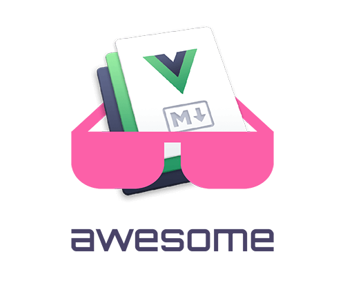

   
  
   
   

# Awesome VuePress V2 

> A curated list of awesome things related to VuePress V2

- [Awesome VuePress V2 ](#awesome-vuepress-v2-)
  - [Resources](#resources)
    - [Official Resources](#official-resources)
    - [Tutorials](#tutorials)
    - [Examples](#examples)
  - [Plugins](#plugins)
    - [Official Plugins](#official-plugins)
    - [Community Plugins](#community-plugins)
  - [Themes](#themes)
    - [Official Themes](#official-themes)
    - [Community Themes](#community-themes)
  - [Projects Using VuePress@v2](#projects-using-vuepressv2)
    - [Official Projects](#official-projects)
    - [Blogging](#blogging)
    - [Open Source](#open-source)
  - [License](#license)

## Resources

### Official Resources

- [Docs - Official Guide](https://v2.vuepress.vuejs.org/guide/)
- [Docs - Config Reference](https://v2.vuepress.vuejs.org/reference/config.html)
- [Docs - GitHub Repo](https://github.com/vuepress/vuepress-next)

### Tutorials

- [A step by step tutorial creating and using VuePress Project](https://vuepress-theme-hope.github.io/v2/cookbook/tutorial/) ([中文版本](https://vuepress-theme-hope.github.io/v2/zh/cookbook/tutorial/))

- [Markdown Guide](https://vuepress-theme-hope.github.io/v2/cookbook/markdown/) ([中文版本](https://vuepress-theme-hope.github.io/v2/zh/cookbook/markdown/))

### Examples

- [Mr.Hope's Blog](https://github.com/Mister-Hope/Mister-Hope.github.io): An example to use VuePress2 to build blogs on GitHub Pages. Check [Deploy workflow](https://github.com/Mister-Hope/Mister-Hope.github.io/blob/main/.github/workflows/deploy.yml) for more details.

## Plugins

### Official Plugins

**Maintained by [vuepress](https://github.com/vuepress):**

- [@vuepress/plugin-active-header-links](https://v2.vuepress.vuejs.org/reference/plugin/active-header-links.html): Update route hash when scrolling pages.
- [@vuepress/plugin-back-to-top](https://v2.vuepress.vuejs.org/reference/plugin/back-to-top.html): Back to top button
- [@vuepress/plugin-container](https://v2.vuepress.vuejs.org/reference/plugin/container.html): Register markdown custom containers in your VuePress site.
- [@vuepress/plugin-docsearch](https://v2.vuepress.vuejs.org/reference/plugin/docsearch.html): Integrate [Algolia DocSearch](https://docsearch.algolia.com/) into VuePress
- [@vuepress/plugin-external-link-icon](https://v2.vuepress.vuejs.org/reference/plugin/external-link-icon.html): Add a icon to the external link in your markdown content
- [@vuepress/plugin-git](https://v2.vuepress.vuejs.org/reference/plugin/git.html): Collect git information of your pages, including the created and updated time, the contributors, etc.
- [@vuepress/plugin-google-analytics](https://v2.vuepress.vuejs.org/reference/plugin/google-analytics.html): Integrate [Google Analytics](https://analytics.google.com/) into VuePress.
- [@vuepress/plugin-medium-zoom](https://v2.vuepress.vuejs.org/reference/plugin/medium-zoom.html): Integrate [medium-zoom](https://github.com/francoischalifour/medium-zoom#readme) into VuePress.
- [@vuepress/plugin-palette](https://v2.vuepress.vuejs.org/reference/plugin/palette.html): Provide palette support for your theme.
- [@vuepress/plugin-prismjs](https://v2.vuepress.vuejs.org/reference/plugin/prismjs.html): Enable syntax highlighting for markdown code fence with [Prism.js](https://prismjs.com/)
- [@vuepress/plugin-pwa-popup](https://v2.vuepress.vuejs.org/reference/plugin/pwa-popup.html): Provide a popup component for users to activate the new PWA service worker manually.
- [@vuepress/plugin-pwa](https://v2.vuepress.vuejs.org/reference/plugin/pwa.html): Make your VuePress site a [Progressive Web Application (PWA)](https://developer.mozilla.org/en-US/docs/Web/Progressive_web_apps).
- [@vuepress/plugin-register-components](https://v2.vuepress.vuejs.org/reference/plugin/register-components.html): Register Vue components from component files or directory automatically.
- [@vuepress/plugin-search](https://v2.vuepress.vuejs.org/reference/plugin/search.html): Provide local search to your documentation site.
- [@vuepress/plugin-shiki](https://v2.vuepress.vuejs.org/reference/plugin/shiki.html): Enable syntax highlighting for markdown code fence with [Shiki](https://shiki.matsu.io/)
- [@vuepress/plugin-theme-data](https://v2.vuepress.vuejs.org/reference/plugin/theme-data.html): Provide client data for your theme, with VuePress [i18n](../../guide/i18n.md) support.
- [@vuepress/plugin-toc](https://v2.vuepress.vuejs.org/reference/plugin/toc.html): Provide a table-of-contents (TOC) component.

### Community Plugins

- [vuepress-plugin-blog2](https://vuepress-theme-hope.github.io/v2/blog/): VuePress2 Blog plugin📝
- [vuepress-plugin-comment2](https://vuepress-theme-hope.github.io/v2/comment/): VuePress2 comment plugin💬, supports Giscus, Twikoo and Waline.
- [vuepress-plugin-components](https://vuepress-theme-hope.github.io/v2/components/): Markdown components out of box🧩
- [vuepress-plugin-copy-code2](https://vuepress-theme-hope.github.io/v2/copy-code/): VuePress2 copy code plugin📋, provide copy button for code blocks.
- [vuepress-plugin-copyright2](https://vuepress-theme-hope.github.io/v2/copyright/): VuePress2 copyright plugin📋, append copyright infomation when copying content from site, also suppports disabling copying and selection.
- [vuepress-plugin-feed2](https://vuepress-theme-hope.github.io/v2/feed/): VuePress2 feed plugin 📡
- [vuepress-plugin-lightgallery](https://vuepress-theme-hope.github.io/v2/lightgallery/): Light Gallery plugin for VuePress2
- [vuepress-plugin-md-enhance](https://vuepress-theme-hope.github.io/v2/md-enhance/): VuePress2 Markdown enhancement plugin📄
- [vuepress-plugin-photo-swipe](https://vuepress-theme-hope.github.io/v2/photo-swipe/): VuePress2 photo preview plugin🔍
- [vuepress-plugin-pwa2](https://vuepress-theme-hope.github.io/v2/pwa/): VuePress2 PWA plugin📦
- [vuepress-plugin-reading-time2](https://vuepress-theme-hope.github.io/v2/reading-time/): VuePress2 reading time plugin⏳
- [vuepress-plugin-redirect2](https://vuepress-theme-hope.github.io/v2/redirect/): VuePress2 redirect plugin↩️
- [vuepress-plugin-sass-palette](https://vuepress-theme-hope.github.io/v2/sass-palette/): VuePress2 palette plugin for sass🎨, an improved edition over the official one.
- [vuepress-plugin-seo2](https://vuepress-theme-hope.github.io/v2/seo/): VuePress SEO plugin🛠
- [vuepress-plugin-sitemap2](https://vuepress-theme-hope.github.io/v2/sitemap/): VuePress2 Sitemap plugin🗺️
- [vuepress-plugin-use-pages](https://github.com/monsat/vuepress-plugin-use-pages) - A VuePress v2 plugin that helps you use array of all PagesData in your doc.
- [@snippetors/vuepress-plugin-tabs](https://www.npmjs.com/package/@snippetors/vuepress-plugin-tabs) - A VuePress plugin which renders custom markdown containers as tabs, for vuepress v2.x
- [vuepress-plugin-archive](https://www.npmjs.com/package/vuepress-plugin-archive) - A VuePress plugin that add article archiving and timeline functions to the site, for vuepress v2.x
- [vuepress-plugin-netabare-switch](https://github.com/monsat/vuepress-plugin-netabare-switch) - A VuePress v2 plugin to add toggle switch for spoilers.
- [vuepress-plugin-china-search-console](https://vuepress.qbb.sh/china-search-console/) - 🌐 A VuePress v2 plugin to enhance china seo | include **baidu tongji (analytics)**, baidu auto push, 360 autopush, tiaotiao(ByteDance) autopush.
- [vuepress-plugin-imagemin](https://github.com/yjl9903/vuepress-plugin-imagemin): A VuePress v2 plugin for compressing image assets.
- [@goy/vuepress-plugin-svg-icons](https://github.com/ntnyq/vuepress-plugin-svg-icons): A VuePress plugin for managing svg icons via svg sprite
- [vuepress-plugin-social-share](https://github.com/ntnyq/vuepress-plugin-social-share/tree/next): A VuePress plugin which provides social sharing services
- [vuepress-plugin-iconify](https://github.com/ntnyq/vuepress-plugin-iconify): A VuePress v2 plugin make it easier to use icons in VuePress
- [vuepress-plugin-netlify-functions](https://github.com/pengzhanbo/vuepress-theme-plume/tree/main/packages/plugin-netlify-functions) A vuepress v2 plugin to basis support for netlify functions when you want deploy to netlify and use netlify functions.
- [vuepress-plugin-markdown-define2](https://github.com/justforuse/vuepress-plugin-markdown-define2): A plugin to define variables in markdown for Vuepress 2.
- [@condorhero/vuepress-plugin-export-pdf-v2](https://github.com/condorheroblog/vuepress-plugin/tree/main/packages/vuepress-plugin-export-pdf-v2): A VuePress v2 plugin exports your website as a PDF file.
- [vuepress-plugin-anchor-right](https://github.com/dingshaohua-cn/vuepress-plugin-anchor-right):  A VuePress v2 plugin,It is used to generate the right navigation directory anchor!
- [vuepress-plugin-full-text-search2](https://github.com/ota-meshi/vuepress-plugin-full-text-search2): VuePress v2 plugin that adds full-text search box.
- [vuepress-plugin-copy-code-button](https://github.com/azat-io/azat-io/tree/main/plugins/copy-code-button): Plugin for adding copy code button and label with the name of the language
- [vuepress-plugin-edit-page-link](https://github.com/azat-io/azat-io/tree/main/plugins/edit-page-link): Plugin for getting edit page in repository link
- [vuepress-plugin-mermaid-wrapper](https://github.com/azat-io/azat-io/tree/main/plugins/mermaid-wrapper): Plugin for using Mermaid.js
- [vuepress-plugin-open-graph](https://github.com/azat-io/azat-io/tree/main/plugins/open-graph): Plugin for generating open graph meta tags
- [vuepress-plugin-posts](https://github.com/azat-io/azat-io/tree/main/plugins/posts): Plugin for blogging
- [vuepress-plugin-remove-html-extension](https://github.com/azat-io/azat-io/tree/main/plugins/remove-html-extension): Plugin for generating clean urls
- [vuepress-plugin-umami-analytics](https://github.com/azat-io/azat-io/tree/main/plugins/umami-analytics): Plugin for using Umami analytics
- [vuepress-plugin-alert](https://github.com/wuwb/vuepress-plugin-alert): Plugin for add site announcement on the top right corner.

<!-- duplicate plugins with same feature -->

- [vuepress-plugin-clipboard](https://vuepress.qbb.sh/clipboard/): 🔘 A VuePress v2 plugin to generate **code copy button** | 代码块复制按钮
- [@snippetors/vuepress-plugin-code-copy](https://www.npmjs.com/package/@snippetors/vuepress-plugin-code-copy) - A VuePress plugin which provides a button to copy code block, for vuepress v2.x

<!-- This is not end of the list, place your plugin above. -->

## Themes

### Official Themes

- [@vuepress/theme-default](https://github.com/vuepress/vuepress-next/tree/main/packages/%40vuepress/theme-default)

### Community Themes

- [vuepress-theme-hope](https://vuepress-theme-hope.github.io/v2/): A powerful theme with full of features, supports both documentation and blogging.
- [vuepress-theme-reco](http://v2.vuepress-reco.recoluan.com/): 🔥 The 2.x of vuepress-theme-reco.
- [vuepress-theme-gungnir](https://v2-vuepress-theme-gungnir.vercel.app/): 😺 A cool blog theme for VuePress 2.
- [vuepress-theme-mix](https://vuepress-theme-mix.vercel.app/): 🎨 A VuePress 2 theme with a mix of features.
- [vuepress-theme-dog](https://github.com/artiely/blog-dog): Opinionated vuepress blog theme. [Preview](https://artiely.github.io/?page=1)
- [vuepress-theme-plume](https://pengzhanbo.cn/note/vuepress-theme-plume/) A Vuepress blog theme, low config，simple and beautiful.
- [vuepress-theme-knzn](https://github.com/zhb333/vuepress-theme-knzn) A Vuepress awesome blog theme. [Preview](https://www.knzn.net/)
- [vuepress-theme-teadoc](https://github.com/wuwb/vuepress-theme-teadoc) A new doc theme base on @vuepress/theme-default. [Preview](https://lab.tongdelove.com/teadoc/)

## Projects Using VuePress@v2

### Official Projects

> To be completed.

### Blogging

> Blog websites that use VuePress@v2.

- [Mr.Hope's Blog](https://mrhope.site)
- [Q.ben's Blog](https://blog.qbb.sh/)
- [Renovamen's Blog](https://blog.zxh.io/)
- [Knzn's Blog](https://www.knzn.net/)
- [Azat's Blog](https://azat.io)

### Open Source

> Documentation websites that use VuePress@v2.

- [VuePress Theme Hope](https://vuepress-theme-hope.github.io): VuePress Theme Hope Offical Docs
- [Waline](https://waline.js.org): A safe and fast comment system
- [Fast Request](https://dromara.org/fast-request): IntelliJ IDEA plugin RESTful Fast Request
- [JavaGuide](https://javaguide.cn/): 「Java 学习+面试指南」一份涵盖大部分 Java 程序员所需要掌握的核心知识。
- [cz-git](http://cz-git.qbenben.com/): 🔨 A more engineered, highly customizable commitizen adapter | commitizen 适配器
- [US-FE](https://us-fe.github.io/): US-FE 北美最大前端组织
- [ustc campus](https://ustc.gleamoe.com/): 中国科大夏令营指南与答疑汇总

## License

To the extent possible under law, [ULIVZ](https://github.com/ulivz) and [Mister-Hope](https://github.com/Mister-Hope) has waived all copyright and related or neighboring rights to this work.
